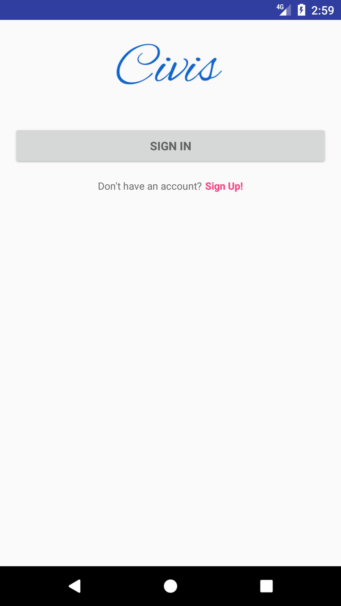
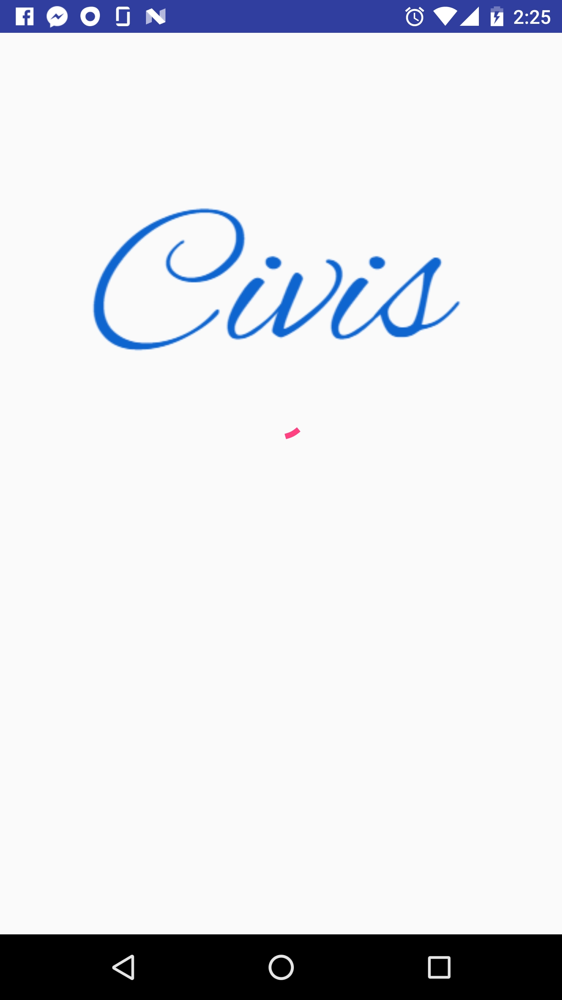
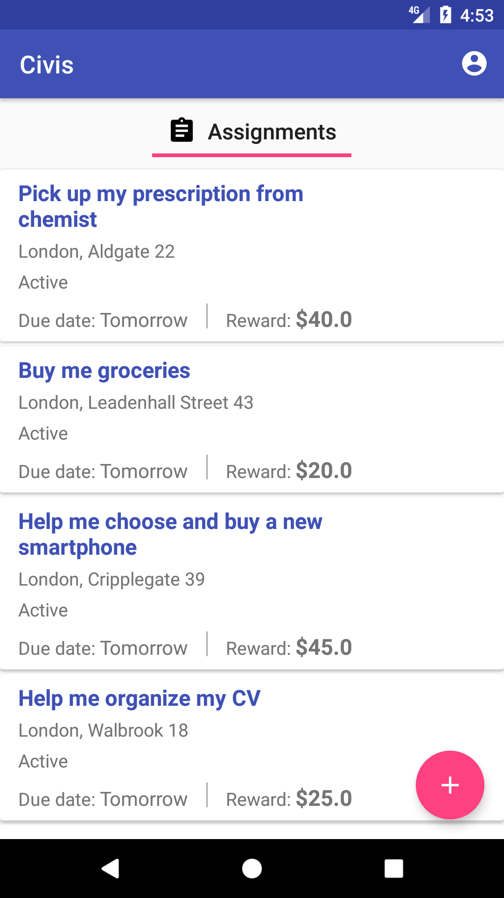
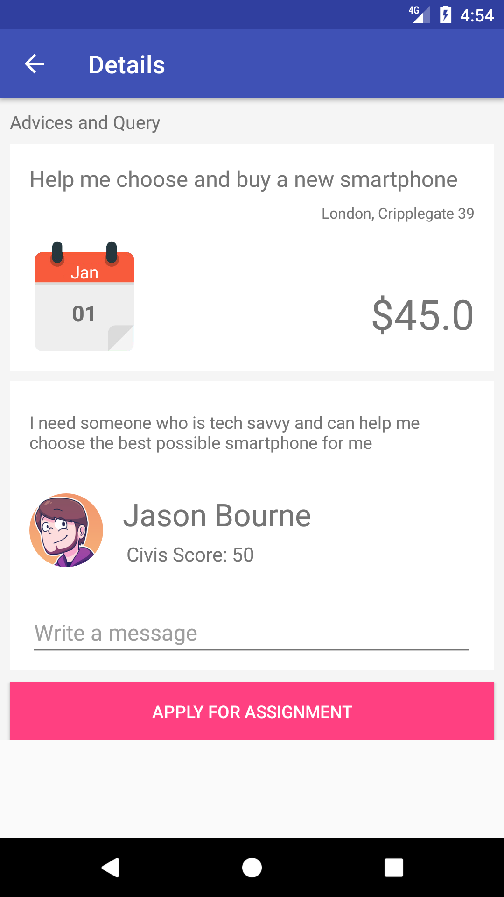
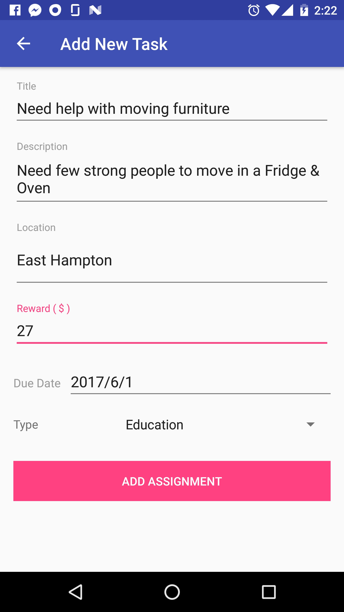
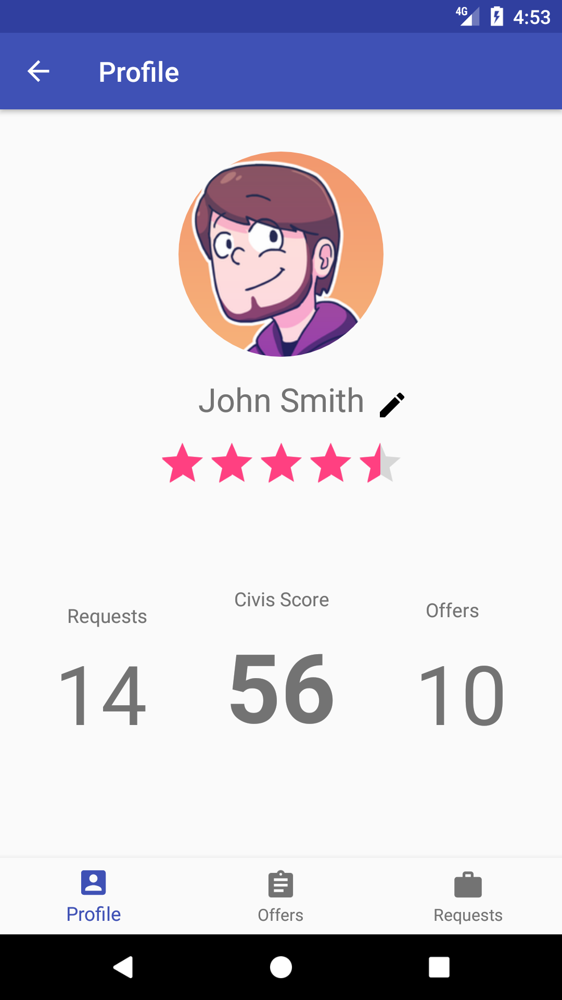
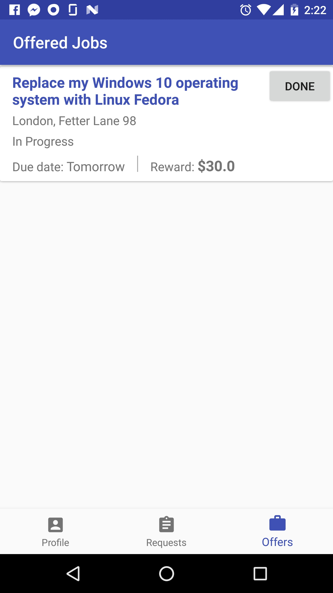
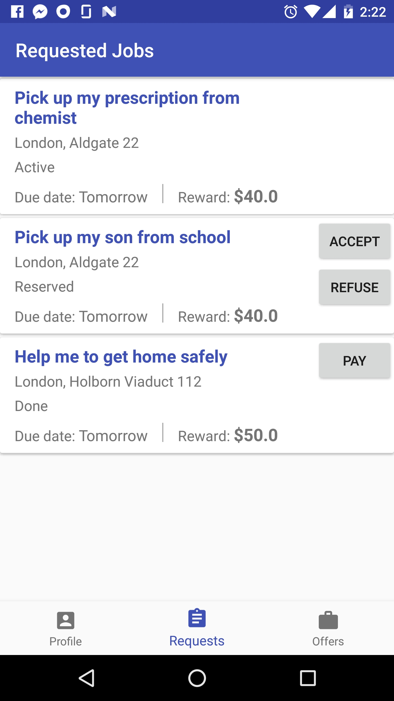

# Civis
ddfdsfdsfsdfdf
## Instructions to run

In order to authenticate, if your phone have set default application to handle http://.... url, please reset it. The phone should ask you with which application you want to open this after authentication. This is because the current client of digitaltown doesn't allow us to use custom scheme beside http:// & https://. I have received mail that this will be updated in following days, but until then we're stuck with this option.

 

 

  

   

   
